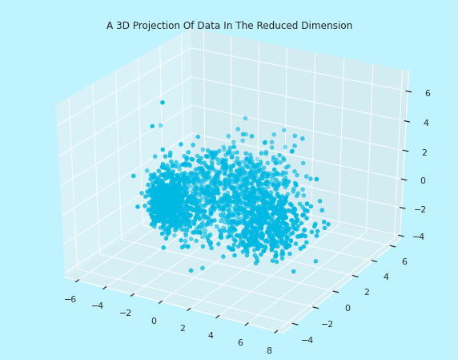

# Customer Personality Analysis with K-Means, Agglomerative, Mean Shift and Density-based Spatial Clustering 

In this project, I will be performing an unsupervised clustering of data on the customer's records from a groceries firm's database. Customer segmentation is the practice of separating customers into groups that reflect similarities among customers in each cluster. I will divide customers into segments to optimize the significance of each customer to the business. To modify products according to distinct needs and behaviours of the customers. It also helps the business to cater to the concerns of different types of customers.


<br>

<p align="center">

</p>

<br>

## Table of Contents
  * [What is Customer Personality Analysis?](#what-is-customer-personality-analysis?)
  * [Clustering Techniques](#clustering-techniques)
  * [Data Workflow](#data-workflow)
  * [Observations](#observations)
  * [Setup](#setup)
  * [Todos](#todos)
  * [Acknowledgements](#acknowledgements)
  * [Citation](#citation)
  * [Connect with me](#connect-with-me)

  <br>


## What is Customer Personality Analysis?

Customer personality analysis, also known as customer profiling, is a process that helps businesses understand their customers' preferences, needs, and motivations by categorizing them into distinct groups based on various traits, behaviors, and characteristics. Clustering methods, such as k-means, hierarchical clustering, or DBSCAN, can be used to group customers with similar traits and behaviors together, creating meaningful customer personas. The benefits of customer personality analysis include improved marketing strategies, enhanced customer engagement, product and service development, and segmentation and targeting. Clustering methods can also uncover hidden patterns and trends within customer data, allowing businesses to personalize their marketing efforts for each cluster and adapt to changes in customer behavior over time.

## Clustering Techniques

K-means, DBSCAN, Agglomerative clustering, and Mean Shift are all clustering methods used in unsupervised machine learning to group data points into clusters based on their similarity. Each method has its own approach and characteristics. K-means is suitable for spherical clusters and requires specifying K in advance. DBSCAN is density-based and discovers clusters of varying shapes without needing K. Agglomerative clustering creates hierarchical cluster structures, and the number of clusters can be determined post-hoc. Mean Shift is a mode-seeking method that can find clusters of varying shapes without predefining K but may be computationally intensive. 


**K-means Clustering**:

K-means is a centroid-based clustering method, where it partitions data into K clusters, with each cluster represented by its centroid (the mean of data points in that cluster). It assumes that clusters are spherical and of similar size. The number of clusters, K, needs to be specified in advance, and the algorithm seeks to optimize cluster assignment to minimize the sum of squared distances from data points to their respective cluster centroids. The results can vary depending on the initial placement of centroids, so multiple runs with different initializations may be required. It is computationally efficient for large datasets and is widely used in practice for its simplicity.

**DBSCAN (Density-Based Spatial Clustering of Applications with Noise)**:

DBSCAN focuses on the density of data points. It identifies dense regions as clusters and is robust to noise and outliers. Unlike K-means, DBSCAN does not require the number of clusters to be predetermined. It automatically identifies the number of clusters based on data density. DBSCAN can discover clusters of various shapes and sizes. The choice of hyperparameters, like epsilon (a distance threshold) and the minimum number of points required to form a cluster, can affect results. DBSCAN works well on datasets with irregularly shaped clusters and varying densities.

**Agglomerative Clustering**:

Agglomerative clustering builds a hierarchical representation of clusters. It starts with individual data points as clusters and then merges them based on proximity until a single cluster encompasses all data. Similar to DBSCAN, the number of clusters is not predetermined; instead, you decide the level of granularity by choosing where to cut the hierarchy Agglomerative clustering can produce clusters of varying sizes and shapes. It can be computationally expensive, especially for large datasets, as it involves pairwise distance calculations.

**Mean Shift**:

Mean Shift is a mode-seeking algorithm that aims to find dense regions in the data space. It iteratively shifts data points towards the mode (the densest region) of their local distribution. Like DBSCAN and Agglomerative clustering, Mean Shift does not require the number of clusters to be defined in advance. It can identify clusters of varying sizes and shapes.
It may be computationally expensive, especially for high-dimensional data. The choice of the bandwidth parameter influences the results, so it requires careful tuning.


## Data Workflow

n this project, initially data cleaning and feature engineering were conducted to refine the dataset, followed by dimensionality reduction using Principal Component Analysis (PCA) for improved insights. Through visualization and the utilization of the elbow method, I determined the optimal number of clusters for customer segmentation. Four distinct clustering methods K-means, DBSCAN, Mean Shift, and Agglomerative were applied to segment customers based on their purchasing behavior and preferences. Subsequently, I evaluated and profiled these customer clusters, providing valuable insights to the grocery store for targeted marketing, personalized shopping experiences, and improved customer engagement strategies.


Correlation matrix:

<p align="center">

</p>

Results of Elbow method to find the number of optimal clusters.

<p align="center">

</p>

 I also applied Principal component analysis before applying any model. The data looks something like this if we visualize it in 3D space:

 <p align="center">

</p>
 


After that I have applied Complete Agglomerative clustering with 4 clusters:

<p align="center">

</p>

Average Agglomerative clustering with 4 clusters:

<p align="center">

</p>

K-Means clusters: 

<p align="center">

</p>

Mean-shift clusters:

<p align="center">

</p>

Density based Spatial Clustering:

<p align="center">

</p>

## Observations

In the end, I have concluded with the following observations from the complete Agglomerative Clustering that:

1) Cluster 0 are parents who have arounf 2 to 4 members in family and single parents are also included in this. This cluster consists of relatively older people.

2) Cluster 1 are not parents. They are high income people with max 2 members in family and they span all ages.

3) Cluster 2 are parents and are relatively younger with only one child. At max, there are 3 members in family.

4) Cluster 3 are parents but are lower income group. They have max 5 people and min 3 people in family.


## Setup

So we talked about what telephone based social engineering attacks are, and what they can do for you (among other things). <br/>
Let's get this thing running! Follow the next steps:

1. `git clone https://github.com/abideenml/CustomerPersonalityAnalysis-with-KMeans-ACM-MS-DBSCAN`
2. Navigate into project directory `cd path_to_repo`
3. Create a new venv environment and run `pip install -r requirements.txt`
4. Run the `Clustering.ipynb` file.

That's it! <br/>


## Todos:

Finally there are a couple more todos which I'll hopefully add really soon:
* Explore how these clustering models perform on huge amounts of data.
* Productionize these models to get weekly reports regarding the customers.


## Acknowledgements

I found these resources useful (while developing this one):

* [Clustering | Introduction, Different Methods, and Applications](https://www.analyticsvidhya.com/blog/2016/11/an-introduction-to-clustering-and-different-methods-of-clustering/)
* [Understanding Mean Shift Clustering and Implementation with Python](https://towardsdatascience.com/understanding-mean-shift-clustering-and-implementation-with-python-6d5809a2ac40)


## Citation

If you find this code useful, please cite the following:

```
@misc{Zain2023CustomerPersonalityAnalysis,
  author = {Zain, Abideen},
  title = {customer-personality-analysis},
  year = {2023},
  publisher = {GitHub},
  journal = {GitHub repository},
  howpublished = {\url{https://github.com/abideenml/CustomerPersonalityAnalysis-with-KMeans-ACM-MS-DBSCAN}},
}
```

## Connect with me

If you'd love to have some more AI-related content in your life :nerd_face:, consider:

* Connect and reach me on [LinkedIn](https://www.linkedin.com/in/zaiinulabideen/) and [Twitter](https://twitter.com/zaynismm)
* Follow me on 📚 [Medium](https://medium.com/@zaiinn440)
* Subscribe to my 📢 weekly [AI newsletter](https://rethinkai.substack.com/)!

## Licence

[](https://github.com/abideenml/CustomerPersonalityAnalysis-with-KMeans-ACM-MS-DBSCAN/blob/master/LICENCE)