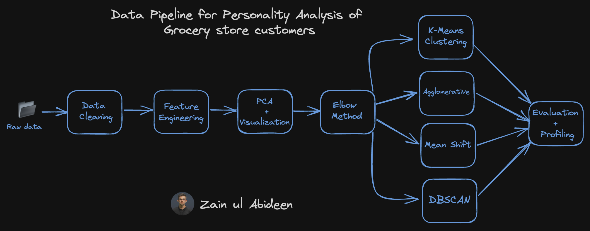

# Customer Personality Analysis with K-Means, Agglomerative, Mean Shift and Density-based Spatial Clustering 

In this project, I have aggregated data of a grocery store and applied exploratory data analysis on it   to understand it. We can observe the effect of major features as shown below:


<p align="center">

</p>


## Table of Contents
  * [What is Customer Personality Analysis?](#what-is-customer-personality-analysis?)
  * [Clustering Techniques](#clustering-techniques)
  * [Data Workflow](#data-workflow)
  * [Observations](#observations)
  * [Setup](#setup)
  * [Todos](#todos)
  * [Acknowledgements](#acknowledgements)
  * [Citation](#citation)
  * [Connect with me](#connect-with-me)

  <br>


## What is Customer Personality Analysis?


## Clsutering Techniques


## Data Workflow


Correlation matrix:


Then i applied Elbow method to find the number of optimal clusters.


 I have also applied Principal component analysis before applying any model. The data looks something like this if we visualize it in 3D space:
 
 


After that I have applied Complete Agglomerative clustering with 4 clusters:


Average Agglomerative clustering with 4 clusters:


K-Means clusters: 


Mean-shift clusters:


Density based Spatial Clustering:


## Observations

In the end, I have concluded with the following observations from the complete Agglomerative Clustering that:

Cluster 0 are parents who have arounf 2 to 4 members in family and single parents are also included in this. This cluster consists of relatively older people.

Cluster 1 are not parents. They are high income people with max 2 members in family and they span all ages.

Cluster 2 are parents and are relatively younger with only one child. At max, there are 3 members in family.

Cluster 3 are parents but are lower income group. They have max 5 people and min 3 people in family.


## Setup

So we talked about what telephone based social engineering attacks are, and what they can do for you (among other things). <br/>
Let's get this thing running! Follow the next steps:

1. `git clone https://github.com/abideenml/CustomerPersonalityAnalysis-with-KMeans-ACM-MS-DBSCAN`
2. Navigate into project directory `cd path_to_repo`
3. Create a new venv environment and run `pip install -r requirements.txt`
4. Run the `Clustering.ipynb` file.

That's it! <br/>


## Todos:

Finally there are a couple more todos which I'll hopefully add really soon:
* Explore how these clustering models perform on huge amounts of data.
* Productionize these models to get weekly reports regarding the customers.


## Acknowledgements

I found these resources useful (while developing this one):

* [Clustering | Introduction, Different Methods, and Applications](https://www.analyticsvidhya.com/blog/2016/11/an-introduction-to-clustering-and-different-methods-of-clustering/)
* [Understanding Mean Shift Clustering and Implementation with Python](https://towardsdatascience.com/understanding-mean-shift-clustering-and-implementation-with-python-6d5809a2ac40)


## Citation

If you find this code useful, please cite the following:

```
@misc{Zain2023CustomerPersonalityAnalysis,
  author = {Zain, Abideen},
  title = {customer-personality-analysis},
  year = {2023},
  publisher = {GitHub},
  journal = {GitHub repository},
  howpublished = {\url{https://github.com/abideenml/CustomerPersonalityAnalysis-with-KMeans-ACM-MS-DBSCAN}},
}
```

## Connect with me

If you'd love to have some more AI-related content in your life :nerd_face:, consider:

* Connect and reach me on [LinkedIn](https://www.linkedin.com/in/zaiinulabideen/) and [Twitter](https://twitter.com/zaynismm)
* Follow me on 📚 [Medium](https://medium.com/@zaiinn440)
* Subscribe to my 📢 weekly [AI newsletter](https://rethinkai.substack.com/)!

## Licence

[](https://github.com/abideenml/CustomerPersonalityAnalysis-with-KMeans-ACM-MS-DBSCAN/blob/master/LICENCE)